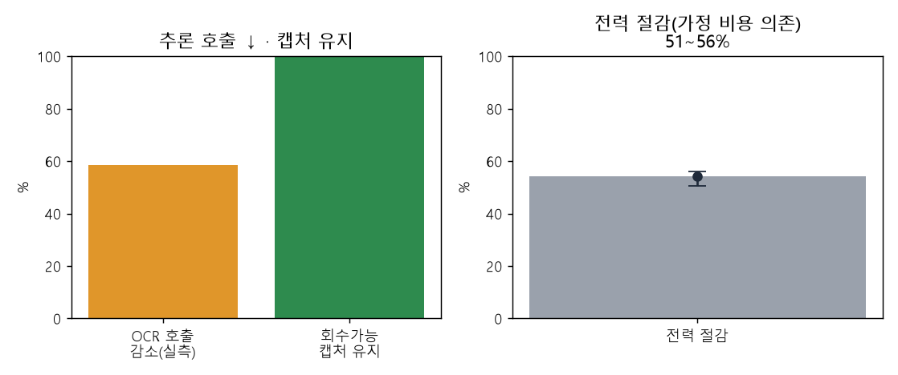
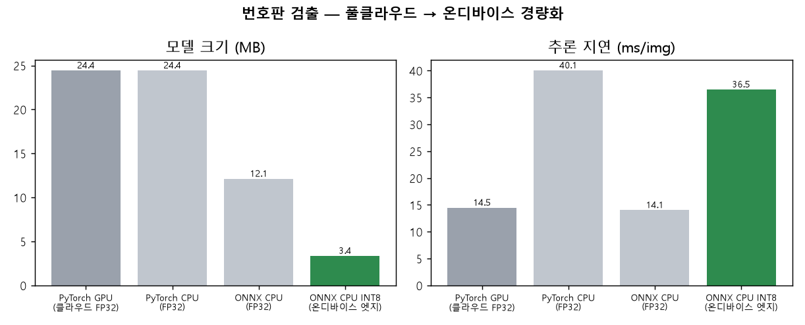
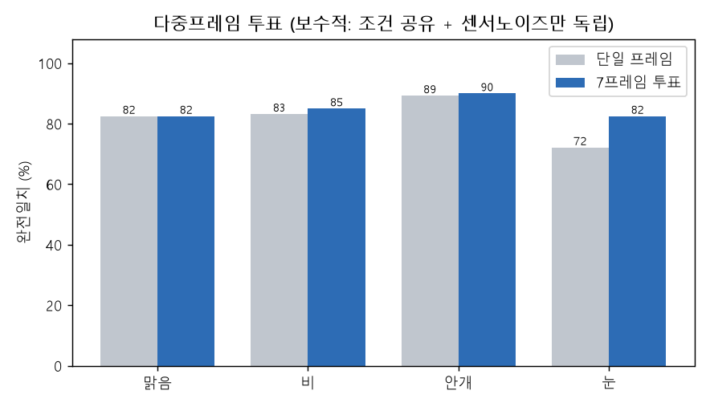
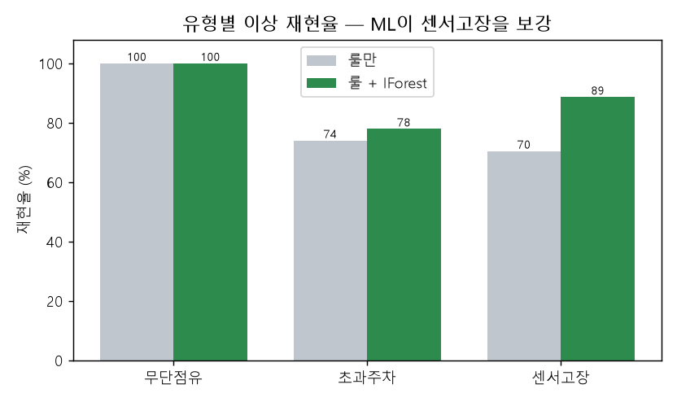
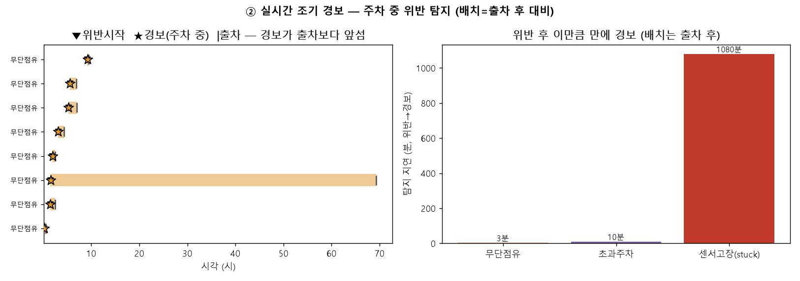
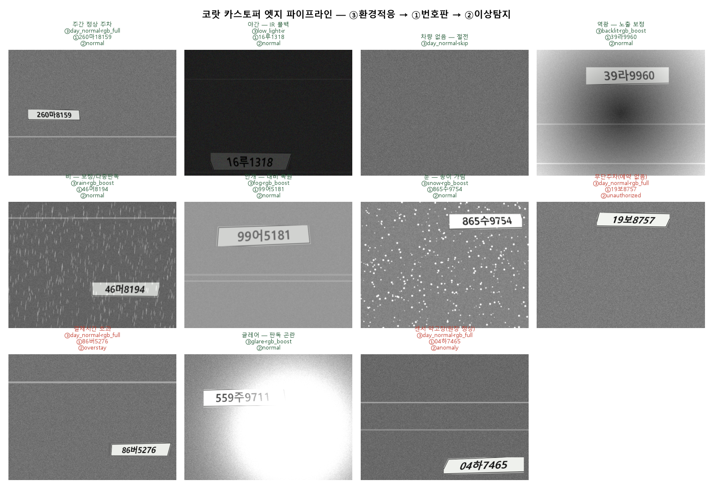

# 코랏 스마트 카스토퍼 엣지-비전 파이프라인 (Project 3)

## 개요

코랏(CoLot) 무인 주차관제 **스마트 카스토퍼**가 수행한 엣지-비전 처리를,
한 디바이스의 입출차 1회 흐름으로 재현한 **공개/합성 데이터 기반 레퍼런스 구현**.
세 모듈이 한 파이프라인으로 결합된다.

```
프레임 도착
  → ③ 휘도·악천후 환경적응 ─ 센싱 모드(RGB/IR/보정/절전) · 추론 여부 결정
       → (추론 시) ① 번호판 검출 + OCR ─ 온디바이스 경량화
  → 출차 시 점유 세션 × 예약/결제 원장
       → ② 불법주차 이상탐지 (무단 / 초과 / 센서고장)
```

> **데이터 정직성.** 원 코랏 운영 데이터는 비공개이므로, 공개 모델(YOLOv8n·EasyOCR)과
> 합성/시뮬레이션 데이터로 *동일한 의사결정 구조*를 재현·검증한다. 모든 수치는
> 합성 평가셋 기준이며 고정 시드로 재현 가능하다. 모델 연구가 아닌 **엣지-AI 시스템의
> 기획·통합·검증** 역량을 보이는 것이 목적이다.
>
> **★실데이터 교차검증.** 합성-온리 한계를 닫기 위해 HF 공개 실데이터로 검증:
> ① EasyOCR 실 판독 **87%**(실 전이), 검출기 **합성→실 fine-tune mAP50 0.294→0.950**(도메인
> 갭을 실 데이터 적응으로 해소). ③ 실 도로장면(BDD100K 1,053장): **저조도(야간) 0.99 실전이**
> (휘도=물리적)이나 **세부 날씨분류는 실 미전이**(전이 acc 0.36·실보정 0.52) — 합성 날씨피처가
> 실 장면에 안 맞음을 *정직히* 정량화. → [`records/02`](records/02_eval_results.md) ★실데이터 절.

---

## 핵심 기여

| 기여 | 내용 |
|---|---|
| **③ 휘도·악천후 환경적응** | 밝기 5 + 악천후 3 = **8환경** RF 분류(15피처) 0.994(손룰 0.47), **OOD(2차 생성기) 0.981**로 순환성 반박(**8/8 클래스 0.89~1.00**, 과적합 감사 통과). 정책으로 **추론 호출 −58.5%(측정)**·캡처 100% 유지 |
| **① 온디바이스 경량화 + 다중프레임 투표** | YOLOv8n 합성 한글 번호판 → ONNX → **정적 INT8**(24.4→**3.4MB(7.2×↓)**, ONNX-CPU **14ms**, OCR char 0.913→0.895). 다중프레임 문자투표(보수적 모델)로 악천후 OCR 회복(눈 72→**83**·비 83→85%) |
| **② 불법주차 이상탐지 + 실시간 경보 + 정산** | 원장 대조 **룰(P=1.0)** + IsolationForest 센서고장 안전망. **비설계 랜덤고장에서도 75.9→98.1** 입증. **실시간 경보**(주차 중 100% 탐지·지연=grace) + **분단위 정산 e2e** |
| **통합·정직성** | ③→①→② 단일 파이프라인 + CLI + 데모, **pytest 34**. 재검증 감사로 순환성·자기충족·가정 의존을 점검·보정(정직 수치) |

---

## 아키텍처

```
        ┌─────────────── 카스토퍼 엣지 ───────────────┐
프레임 →│ ③ adaptive  휘도+dark-channel+채도 → 환경분류(RF,8) → 정책 │→ mode·run_ocr
        │     │ run_ocr=True                                          │
        │ ① plate    letterbox → YOLOv8n(ONNX/INT8) → crop → EasyOCR │→ 번호판(+포맷검증)
        └──────────────────┬──────────────────────────────────────────┘
                           │ 점유 세션(start,end) + 앱 원장(예약/결제)
        ② anomaly  룰(원장대조) ⊕ IsolationForest(센서이상) → 무단/초과/고장
```

환경 8종 — 밝기: `day_normal·low_light(→IR)·glare·backlit·overexposed` /
악천후: `rain·fog·snow`(대비복원 `rgb_boost`).

---

## 결과 요약

### ③ 휘도·악천후 환경적응 (`kev/adaptive.py`)

| 항목 | 값 |
|---|---|
| 환경분류 정확도 (RandomForest, 8클래스, 15피처, 누수 방지 분할) | **0.994** (손룰 0.472) |
| **OOD — 2차 생성기(다른 파라미터) 일반화** | **0.981** ← 순환성 반박 (8/8 클래스 0.89~1.00, 과적합 감사 통과) |
| **추론 호출 감소 (측정·1차 지표)** | **−58.5%** |
| 회수가능 번호판 캡처 유지율 | 100% |
| 전력 절감 (가정 비용 의존) | 53.9% · 민감도 50~56% |

악천후 OCR 영향(정책 근거): 맑음 82.5% → **눈 62.5% · 비 70.0%**(완전일치).


### ① 번호판 검출 + OCR + 온디바이스 경량화 (`kev/plate.py`)

| 백엔드 | 크기 | 지연(1장) | 검출율 |
|---|---|---|---|
| PyTorch GPU (클라우드 FP32) | 24.4 MB | 14.5 ms | 1.00 |
| **ONNX CPU (FP32)** | 12.1 MB | **14.1 ms** | 1.00 |
| **ONNX CPU INT8 (엣지)** | **3.4 MB** | 36.5 ms | 0.96 |

GPU 없이 CPU 14ms 실시간 · 모델 7.2× 압축 · OCR 문자정확도 0.913→0.895 유지.
*한계*: INT8 CPU 지연은 VNNI/NPU 가속이 없으면 FP32보다 빠르지 않음(이 데스크톱 기준).


**다중프레임 추적 + 판독 투표** (`kev/tracking.py`) — 한 차량을 여러 프레임 관측 →
문자 단위 다수결. **보수적 모델**(트랙당 악천후 고정 + 센서노이즈만 독립)로 정직 하한:

| | 맑음 | 비 | 안개 | 눈 |
|---|---|---|---|---|
| 단일 프레임 | 82.5 | 83.2 | 89.3 | 72.1 |
| **7프레임 투표** | 82.5 | 85.0 | 90.0 | **82.5** |

→ 눈 +10·비 +2%p (실 이득은 이 하한과 상한 사이). 

### ② 불법주차 이상탐지 (`kev/anomaly.py`)

| 구성 | Precision | Recall | F1 |
|---|---|---|---|
| 룰만 (원장 대조) | 1.000 | 0.842 | 0.914 |
| 룰 + IsolationForest | 0.866 | 0.895 | 0.880 |

정직 표기: **F1은 룰만(0.914)이 더 높다** — ML은 센서고장 재현율 안전망(70.5→88.6), 정밀도 1.0→0.87 대가.
**비설계 랜덤고장에서도** 센서고장 재현율 **75.9→98.1** (ML 기여가 데이터 설계와 무관함 입증).


**실시간 조기 경보** (`kev/streaming.py`) — 이벤트-구동 스트림. **주차 중 탐지율 100%**
(출차 후 배치 아님), 탐지 지연=grace(무단 **3분**·초과 **10분**). ('168분 선행'은 위반 지속시간이라 폐기.)

**분단위 정산 e2e** (`kev/billing.py`) — 번호판(①)+점유(센서)→분단위 요금. 7분 주차
**280원**(경쟁사 30분 블록 1,200원 대비 절감) · 초과=할증 · 무단=과태료.



### 통합 데모


---

## 실행

```bash
pip install -r requirements.txt        # torch는 GPU 휠 별도 권장

python scripts/eval_adaptive.py        # ③ 환경분류·전력-커버리지
python scripts/build_plate.py          # ① 학습→ONNX→INT8→벤치→OCR
python scripts/eval_anomaly.py         # ② 이상탐지 P/R/F1
python scripts/eval_weather_ocr.py     # 악천후 OCR 열화
python scripts/eval_voting.py          # 다중프레임 투표 회복
python scripts/eval_streaming.py       # ② 실시간 조기 경보
python scripts/demo_billing.py         # 분단위 정산 영수증
python scripts/make_gallery.py         # 합성 이미지 갤러리
python scripts/make_viz2.py            # ③ 판단·② 데이터 시각화

python -m kev.cli demo                 # ③→①→② 통합 데모
python -m kev.cli adaptive <image.png>
python -m kev.cli plate <image.png>

pytest -q                              # 26 passed
```

## 구조

```
kev/
  adaptive.py     ③ 휘도·악천후 환경적응 (피처·분류·센싱 정책)
  plate.py        ① 검출·ONNX·정적 INT8·OnnxYolo·OCR·포맷교정
  tracking.py     ① 다중프레임 추적 + 문자단위 판독 투표
  plate_synth.py  합성 한글 번호판·장면·조명·악천후 증강
  anomaly.py      ② 룰 + IsolationForest 이상탐지
  streaming.py    ② 실시간 조기 경보 (분 단위 스트림)
  billing.py      분단위 정산 (영수증·할증·과태료)
  occupancy.py    점유/예약 시뮬레이터
  pipeline.py     ③→①→② 통합
  demo.py / cli.py / plotting.py / config.py
scripts/          eval_adaptive · build_plate · eval_anomaly · eval_weather_ocr
                  eval_voting · eval_streaming · demo_billing · make_gallery · make_viz2
tests/            pytest (30)
records/          설계 결정·평가·실행·이슈 기록 (decisions.md 인덱스)
```
